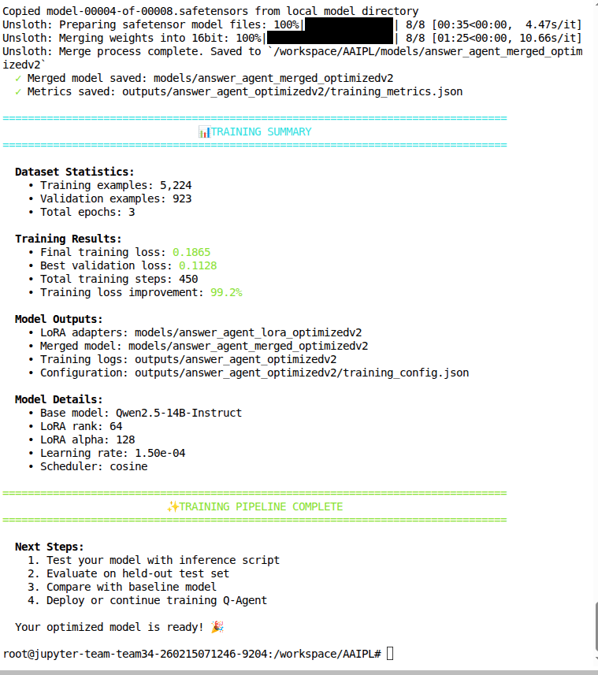
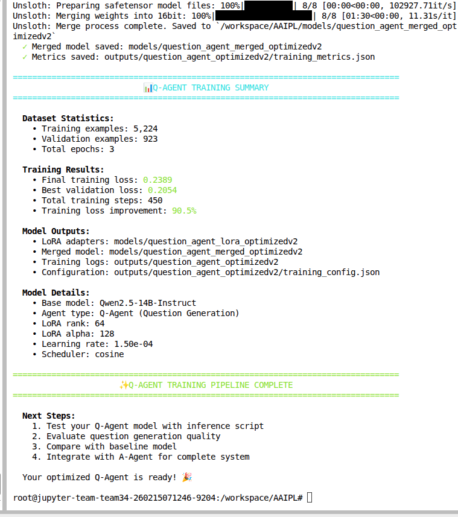

# AAIPL Tournament: Dual-Agent Fine-Tuning Solution

This repository contains my hackathon solution for training two specialized LLM agents for the AAIPL tournament:

- **Q-Agent (Question Agent):** generates challenging, topic-aware MCQ-style questions.
- **A-Agent (Answer Agent):** answers MCQs with structured reasoning in JSON format.

Most repository components were provided by the organizers as baseline/template code.  
My core contribution is in `custom_scripts/` (data preparation + training pipelines), with integration-facing code in `agents/`.

## What I Built

I implemented an end-to-end fine-tuning workflow around **Qwen2.5-14B-Instruct** using **LoRA + 4-bit quantization** (via Unsloth), with separate training data formats and fine-tuning runs for each agent.

### 1) Data Validation and Cleaning

- Script: `custom_scripts/clean_dataset.py`
- Validates each sample for required keys:
  - `topic`, `question`, `choices`, `answer`, `explanation`
- Enforces schema consistency (including exactly 4 choices) and filters invalid samples before training.

### 2) Dataset Conversion for Each Agent

- **Q-Agent data conversion:** `custom_scripts/question-data.py`
  - Converts dataset into chat format where the user asks to generate a topic-specific question and the assistant returns the full question object as JSON.
  - Output: `data/question_agent/question_agent_train.json`

- **A-Agent data conversion:** `custom_scripts/convert_all_data.py`
  - Converts dataset into chat format where input includes topic + question + options and output is a JSON object:
    - `answer`
    - `reasoning`
  - Output: `data/final/answer_agent_train.json`

### 3) Fine-Tuning Pipelines

- **Q-Agent training:** `custom_scripts/fine-train-question.py`
- **A-Agent training:** `custom_scripts/finetune_answer_agent.py`

Both scripts include:

- Qwen2.5-14B-Instruct base model loading from local HF cache
- 4-bit loading + bfloat16 training
- LoRA adapters on attention + MLP + embedding/lm head modules
- ChatML formatting
- Response-only supervised fine-tuning (`train_on_responses_only`)
- Train/validation split with periodic eval + checkpointing
- Early stopping and metrics logging
- Saving both:
  - LoRA adapters
  - merged 16-bit model weights

## Training Configuration (Shared High-Level Setup)

- Base model: `Qwen2.5-14B-Instruct`
- Sequence length: `2048`
- LoRA: `r=64`, `alpha=128`, `dropout=0.05`
- Batch size: `4`
- Gradient accumulation: `8` (effective batch size 32)
- LR: `1.5e-4`, cosine scheduler, warmup ratio `0.1`
- Epochs: `3`
- Optimizer: `adamw_8bit`
- Early stopping enabled

## Training Hardware and Runtime

- Hardware: `AMD MI300` GPUs
- A-Agent fine-tuning time: `21 minutes`
- Q-Agent fine-tuning time: `18 minutes`

## Training Summaries

### A-Agent



### Q-Agent



## How to Reproduce

From repository root:

```bash
# 1) Optional: clean raw datasets
python custom_scripts/clean_dataset.py

# 2) Build Q-Agent training data
python custom_scripts/question-data.py

# 3) Build A-Agent training data
python custom_scripts/convert_all_data.py

# 4) Fine-tune Q-Agent
python custom_scripts/fine-train-question.py

# 5) Fine-tune A-Agent
python custom_scripts/finetune_answer_agent.py
```

## Key Output Locations

- **Q-Agent**
  - LoRA: `models/question_agent_lora_optimizedv2`
  - Merged model: `models/question_agent_merged_optimizedv2`
  - Logs/metrics: `outputs/question_agent_optimizedv2`

- **A-Agent**
  - LoRA: `models/answer_agent_lora_optimizedv2`
  - Merged model: `models/answer_agent_merged_optimizedv2`
  - Logs/metrics: `outputs/answer_agent_optimizedv2`

## Project Structure (Relevant Parts)

- `custom_scripts/` - my custom data processing and fine-tuning scripts
- `agents/` - agent/model integration files for tournament use
- remaining files/folders - organizer-provided scaffold/template

